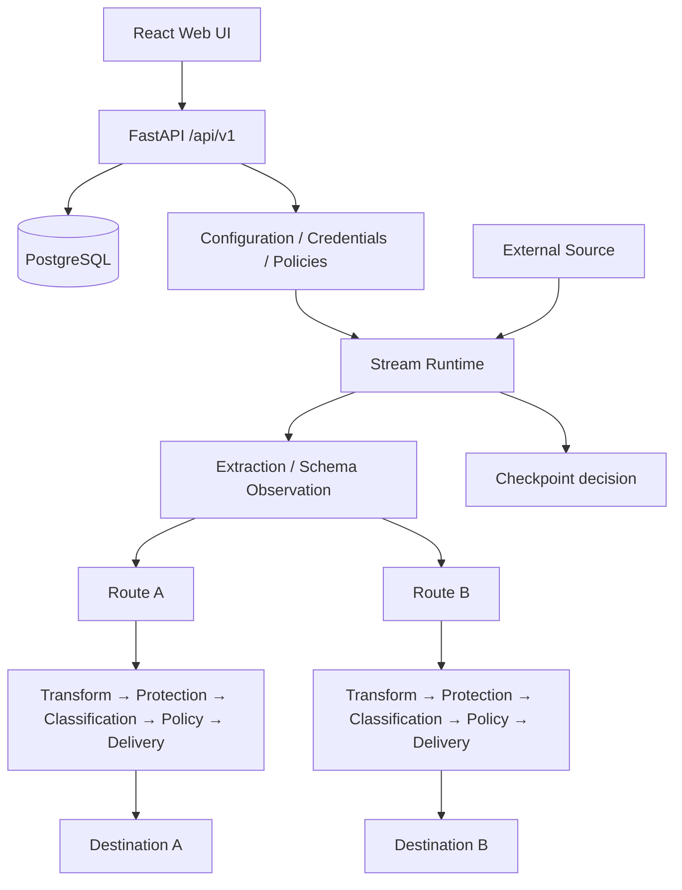

# Architecture

The current implementation combines control-plane configuration with an active data-delivery runtime.



## Control plane

The control plane includes configuration CRUD, authentication/RBAC, Marketplace package lifecycle, credentials, deployment readiness, operator actions, audit, backup/import, and policy configuration.

## Data path

The data path includes source fetch or webhook ingest, extraction, Transform, Protection, Classification, Policy, destination delivery, retry/recovery behavior, runtime evidence, and checkpoint decisions.

<Warning>
DataRelay Control is therefore **not a management-only controller** in the current source. It carries and processes the events it delivers.
</Warning>

## Processing scope

**Stream scope** owns source fetch, event extraction, schema observation/Union Schema context, and source checkpoint state.

**Route scope** owns destination-specific:

```text
Transform → Protection → Classification → Policy → Delivery
```

Mapping and Enrichment remain distinct internal persisted stages even when the UI presents them as one Transform experience.

## Checkpoint invariant

The architecture requires source progress to advance only after the required delivery success, or an explicitly defined absorbed-success outcome. Package installation, backup, Marketplace rollback, or configuration preview must not silently advance checkpoints.

## Trust boundaries

- Browser ↔ reverse proxy/API: TLS is recommended for exposed deployments.
- API/runtime ↔ PostgreSQL: database credentials are required; production should not expose PostgreSQL publicly.
- Runtime ↔ source/destination: connector credentials are resolved at controlled runtime boundaries.
- Marketplace packages: declarative content is validated; package secrets and arbitrary executable package code are rejected in the current V1 model.
