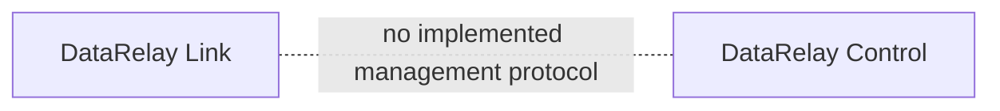

# DataRelay Link Relationship

**DataRelay Link** and **DataRelay Control** are separate products in the current audited repositories.

- DataRelay Link provides connectivity/relay capabilities and has its own documentation at `link.datarelay.run`.
- DataRelay Control provides data collection, processing, protection, delivery, governance, and operational control.

## Current integration status

The audited DataRelay Control source does **not** implement:

- Link instance registration
- Link heartbeat/status synchronization
- centralized Link client or service inventory
- Control-to-Link policy delivery
- shared identity/token enrollment
- remote configuration push to Link
- Link event/audit ingestion contract

Therefore this site does not claim a centralized Control↔Link management plane.

Both products may exist in the same environment, but any operational relationship must be designed and implemented before it is documented as supported.
