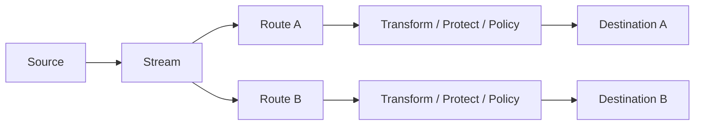

# Data Relay Control

Data Relay Control is the public product name for the software currently implemented in [`datarelay-labs/datarelay-control`](https://github.com/datarelay-labs/datarelay-control). It is an **Enterprise Data Control Gateway**: it collects data, transforms it, applies optional protection and policy controls, and delivers it to one or more destinations.

<Warning>
**Free Early Access.** Data Relay Control is currently available free of charge under the **Data Relay Control Early Access License 1.0**. It is Source Available, not Open Source. Personal use, evaluation, internal business use, permitted internal modification, and customer-owned deployments are allowed. Early Access has no SLA and support is best effort. Commercial General Availability is planned with a **Perpetual License** model. Resale, OEM/white-label use, competing commercial products, and SaaS/MSP/hosted offerings require a separate written commercial license. See [License](/reference/license).
</Warning>

<Note>
This documentation is implementation-driven. The audited development source is `feature/post-m29-development` at `b78aa66eebae`. Stable-release behavior is called out separately.
</Note>

## What it solves

Data Relay Control provides one operational place to configure and observe enterprise data flows without turning every destination into a separate pipeline.

The runtime model is **One Stream → Many Routes → Many Destinations**. A Stream owns execution and source progress. A Route owns destination-specific processing and delivery.

## What administrators can manage today

- local users, roles, login sessions, and password changes
- connectors, credentials, sources, streams, routes, and destinations
- mapping and enrichment, presented in the UI as Transform
- optional Protection, Classification, Policy, Quarantine, and Replay
- operational health, delivery evidence, audit records, backups, and maintenance
- package/Marketplace lifecycle in the current development branch
- safe-change previews, troubleshooting evidence, and environment promotion in the current development branch

## What it intentionally is not

Data Relay Control is not a VPN, generic remote-management tool, SASE platform, SIEM, SOAR, data lake, enterprise IAM system, or endpoint-management platform.

It is also **not currently a centralized manager for Data Relay Link**. The audited source contains no implemented Link registration, heartbeat, policy-delivery, or state-synchronization protocol. See [Data Relay Link relationship](/getting-started/data-relay-link).

## Implementation status at a glance

| Area | Status |
|---|---|
| Core data collection and delivery | Stable implementation lineage |
| Multi-route delivery | Implemented |
| Route Processing | Implemented; default enabled in current source |
| Governance / protection | Implemented, optional |
| Local JWT authentication and RBAC | Implemented |
| Backup / restore tooling | Implemented |
| Marketplace lifecycle and UI | Implemented on development branch; not proven as tagged stable |
| Remote/private registry | Implemented on development branch; not proven as tagged stable |
| AI Connector Builder core | Implemented on development branch; external network AI provider not required |
| Data Relay Link integration | Not supported in audited source |
| Multi-node HA | Not supported as a GA deployment model |

Start with the [Quick Start](/getting-started/quickstart), then review [Architecture](/getting-started/architecture), [License](/reference/license), and [Known Limitations](/reference/limitations).
