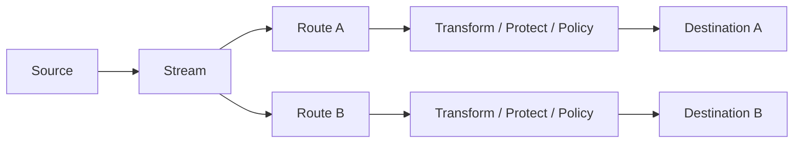

# DataRelay Control

DataRelay Control is a source-available **Enterprise Data Control Gateway** implemented in [`datarelay-labs/datarelay-control`](https://github.com/datarelay-labs/datarelay-control).

It sits in the data path: it collects data, transforms it, applies route-specific protection and policy, records operational evidence, and delivers one Stream through one or many Routes to one or many Destinations.

> **One Stream → Many Routes → Many Destinations**

<Note>
The current product repository identifies the release line as **GA v1.0.2** in its README and changelog. Immutable Git tag evidence is tracked separately on the [Release Status](/reference/release-status) page. Current development documentation follows the canonical `main-v2` source and distinguishes development-only behavior from release-proven behavior.
</Note>

## What it solves

DataRelay Control provides one operational place to configure and observe enterprise data flows without duplicating a full source pipeline for every destination.

A Stream owns execution and source progress. A Route owns destination-specific processing and delivery.

## Current product surface

- connectors, credentials, sources, Streams, Routes, and Destinations
- Mapping and Enrichment, presented in the UI as Transform
- route-specific Protection, Classification, Policy, Quarantine, and Replay
- Dashboard, Streams runtime views, delivery evidence, checkpoints, and audit
- local users, roles, JWT sessions, and RBAC-gated operator/governance surfaces
- backup, restore, upgrade, health, and troubleshooting workflows
- Marketplace/package lifecycle, safe-change preview, connector/API health, test-before-apply, and environment-promotion work present on the current development line

## Product boundary

DataRelay Control is not a VPN, generic remote-management tool, SASE platform, SIEM, SOAR, data lake, enterprise IAM system, ticketing system, or AI-agent platform.

It is also **not a centralized manager for DataRelay Link**. The current Control source does not implement Link registration, heartbeat, policy delivery, state synchronization, or a shared management protocol. See [DataRelay Link relationship](/getting-started/data-relay-link).

## License

DataRelay Control is **Source Available, not Open Source**. The repository `LICENSE` file controls the legal terms. Current permitted use includes personal, research/evaluation, internal commercial use, permitted internal modification, and customer-owned deployment. Productization, resale/OEM, white-labeling, competing products, and SaaS/MSP/hosted offerings require a separate written commercial license.

Start with the [Quick Start](/getting-started/quickstart), then review [Architecture](/getting-started/architecture), [License](/reference/license), [Release Status](/reference/release-status), and [Known Limitations](/reference/limitations).
