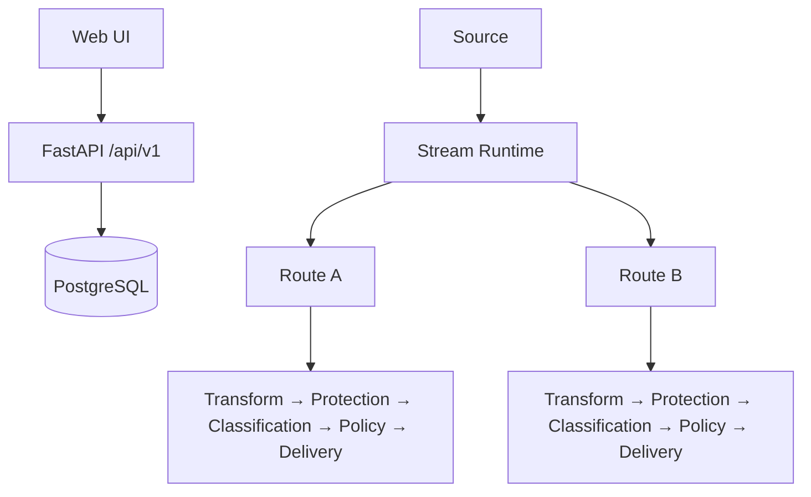

# 아키텍처

## Control Plane

설정 CRUD, 인증/RBAC, Credential, Marketplace lifecycle, Deploy readiness, operator action, audit, backup/import, policy 설정이 포함됩니다.

## Data Path

Source fetch/webhook ingest, extraction, Transform, Protection, Classification, Policy, Destination delivery, retry/recovery, checkpoint가 포함됩니다.

<Warning>
현재 DataRelay Control은 management-only controller가 아닙니다. 실제 이벤트를 처리하고 전달합니다.
</Warning>

Stream은 소스/실행/checkpoint를 소유하고, Route는 목적지별 처리를 소유합니다. Checkpoint는 필요한 delivery 결과가 성공한 뒤에만 진행되는 것이 핵심 invariant입니다.
