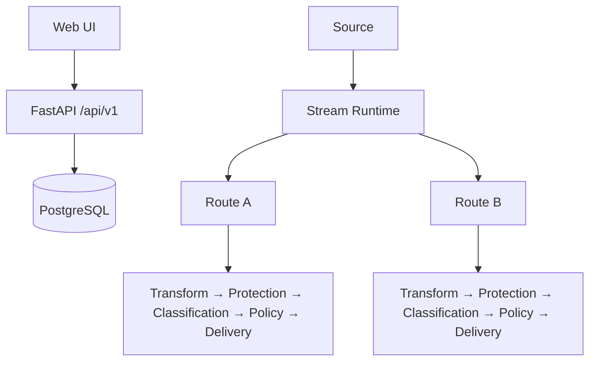

# 아키텍처

```mermaid
flowchart TB
  UI[Web UI] --> API[FastAPI /api/v1]
  API --> PG[(PostgreSQL)]
  SRC[Source] --> RT[Stream Runtime]
  RT --> R1[Route A]
  RT --> R2[Route B]
  R1 --> D1[Transform → Protection → Classification → Policy → Delivery]
  R2 --> D2[Transform → Protection → Classification → Policy → Delivery]
```

## Control plane

설정 CRUD, 인증/RBAC, Credential, Marketplace 패키지 관리, 배포 준비 상태, 운영자 작업, Audit, 백업/가져오기, 정책 설정을 담당합니다.

## Data Path

Source fetch/webhook ingest, extraction, Transform, Protection, Classification, Policy, Destination delivery, retry/recovery, checkpoint가 포함됩니다.

<Warning>
현재 DataRelay Control은 management-only controller가 아닙니다. 실제 이벤트를 처리하고 전달합니다.
</Warning>

Stream은 Source 실행과 Checkpoint를 관리하고, Route는 목적지별 처리를 담당합니다. 필요한 전달이 성공한 뒤에만 Checkpoint가 진행되는 것이 핵심 원칙입니다.
