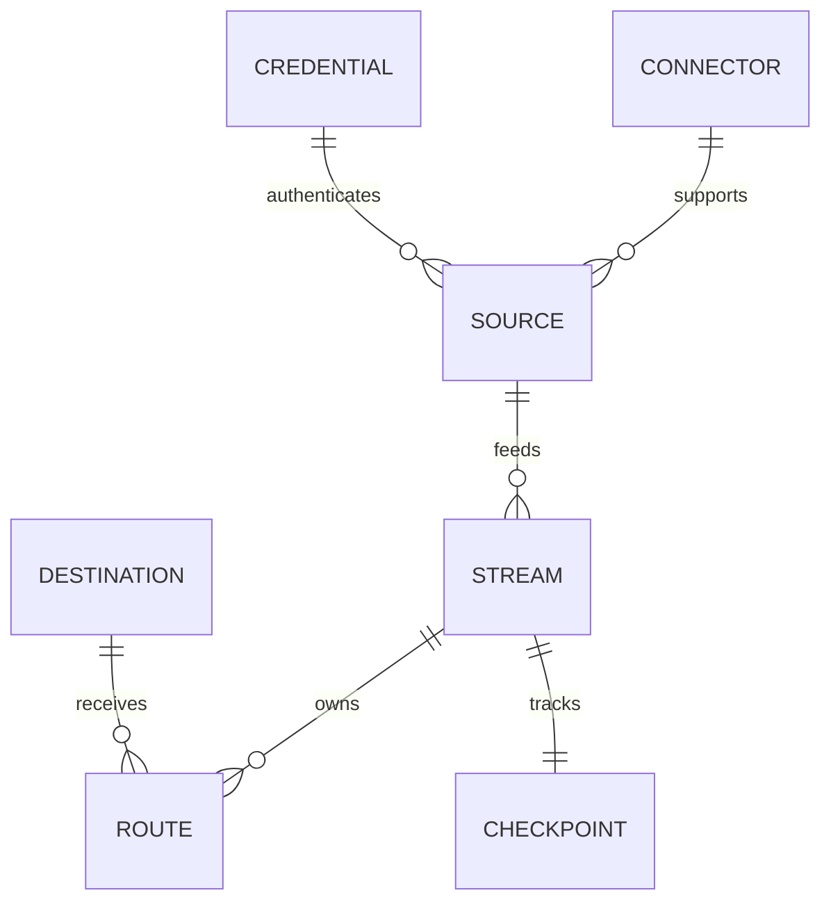

# 데이터 모델

Stream은 실행과 Checkpoint를 관리합니다. Route는 목적지별 처리와 전달을 담당합니다. Credential은 비밀값을 패키지와 분리해 저장하며, Source Pack 자체가 실행 프로세스인 것은 아닙니다.

실제 DB 스키마는 Alembic migration으로 관리하며 플랫폼 데이터베이스는 PostgreSQL만 사용합니다.
